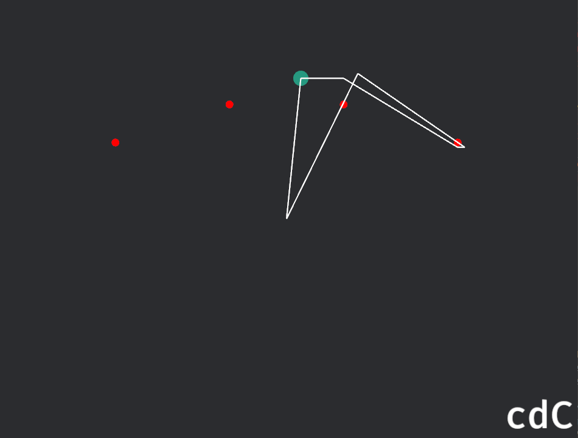

# README

## `charred-path`

`charred-path` is a component-based plugin for Bevy used for recording the homotopy type of a moving object around a specified set of points in 2D.

### Adding the Crate to a Rust Project

To add this crate to your Rust project, add the following line to your `Cargo.toml` file under `[dependencies]`:

```toml
charred-path = "*"
```

Replace `"*"` with the version of the crate you want to use.

### Running the Examples

This crate includes examples that demonstrate how to use the PathPlugin. To run an example, use the `cargo run --example` command followed by the name of the example. To run the basic example, use the following command:

```terminal
cargo run --example homotopy_word_debug
```

Please refer to the source code of the example for more detailed usage instructions.

### API Overview

To get started using this crate in your Bevy project, add `PathPlugin` (and optionally, `PathDebugPlugin`) to your Bevy app using the `add_plugins` method:

```rust
use charred_path::{PathPlugin, PathDebugPlugin};

fn main() {
    App::new()
        // other plugins
        .add_plugins((
            PathPlugin,
            PathDebugPlugin, // the PathDebugPlugin is optional, and for debugging purposes only.
        ))
        .run();
}
```

The `PathPlugin` and `PathDebugPlugin` add systems to your Bevy app that record the path of a moving object around a set of points, called "puncture points". The moving object is specified by adding the `PathType` component to an entity, and the puncture points are specified by adding the `PuncturePoints` component to an entity. For these to function properly, the entity they're attached to must have a `Transform` component.

### Use Cases in Game Development

The `charred-path` crate was initially built with platformers/metroidvanias specifically in mind, but is well-suited to a number of game development scenarios. Here are a few examples:

#### Beta Testing

During beta testing, it can be beneficial to understand the paths that players take through a game. By recording the path of a player's character, developers can gain insights into how players are interacting with the game environment. This can help identify areas of the game that are not being explored, or pinpoint locations where players are getting stuck.

#### Game Logic

The path recording functionality can also be used to influence game logic. For example, you could check whether a player's character went above or below a certain platform and trigger different events based on that information.

### The math behind this crate

The foundational mathematics behind this crate is that of [algebraic topology](https://en.wikipedia.org/wiki/Algebraic_topology), namely [homotopy](https://en.wikipedia.org/wiki/Homotopy). Roughly speaking, two paths are considered _homotopic_ if one path can be transformed into the other continuously, without tearing or jumping over gaps.

Let $n$ be a natual number. The _wedge_ (or _bouquet_) of $n$ circles is the space obtained by gluing together $n$ circles at a single point. [Here](https://en.wikipedia.org/wiki/Wedge_sum#/media/File:Wedge_of_Two_Circles.png) is an example which displays the wedge of two circles. Up to homotopy equivalence, this is the space we are working in when there are $n$ punctured points in the plane.

A loop in the wedge of $n$ circles is encoded as a word in $n$ letters using a specific encoding scheme. Each letter in the word corresponds to a circle in the wedge, and the order of the letters represents the order in which the circles are traversed in the loop. In `charred-path`, the name of a puncture point is the letter used to represent the circle made by traversing around it; capital letters correspond to counter-clockwise traversal, and lowercase letters correspond to clockwise traversal.

To identify distinct paths as distinct strings of letters, we identify each path in the plane with the loop created by closing the ends of the path via the straight line between them. Paths are identified up to _basepoint-preserving homotopy_, which is a version of [relative homotopy](https://en.wikipedia.org/wiki/Homotopy#Relative_homotopy) where the basepoint must remain unmoved. This is a subtle notion which causes loops in the plane to occasionally have word representations which are unexpectedly complicated, but it is necessary to distinguish loops which are distinct in terms of movement. Here is an example from `homotopy_word_debug` which illustrates this:




These two loops are (ambiently) homotopic to one another, since they both just go around D clockwise. However, if the basepoint of the loop (starting position of the player) is not allowed to move, then these are _not_ homotopic. Hence, they represent distinct loops from the perspective of the movement paths, and must be represented differently. In the latter image, one may consider the player as having "gone around C clockwise, then gone around D clockwise, then gone around C counter-clockwise." It is easy to see that doing so is homotopic to that path; this explains the word being `cdC` in that case.

To get a more concrete understanding of the mechanics this crate provides, it's recommended that you play with the `homotopy_word_debug` example.

### Development Roadmap

As of charred-path v0.1.0, paths are encoded as piecewise-linear paths (polylines) and are automatically simplified from the perspective of homotopy. This means that the full path of the player is not encoded. Development is in progress for the following features:

1. Enabling more robust handling for moving entities with puncture points;
2. Allowing the recording of the entire path of the moving object, not just the path up to homotopy;
3. Serialization/deserialization implementations using `serde` for the paths, so that the paths can be saved and loaded for persisting game state mechanics;
4. Integration with physics engines, where impassable physics bodies are labeled with puncture points;
5. 3D path functionality;
6. Path analysis tools for statistics-driven development.

Any additional desired features/bug fixes can of course be requested via the usual channels on Github.

### Compatibility

Here is a table listing the version compatibility between `charred-path` and `bevy`:

| Bevy | `charred-path` |
| ---- | -------------- |
| 0.13 | 0.1.0          |

### License

This project is licensed under the [MIT License](LICENSE-MIT).
